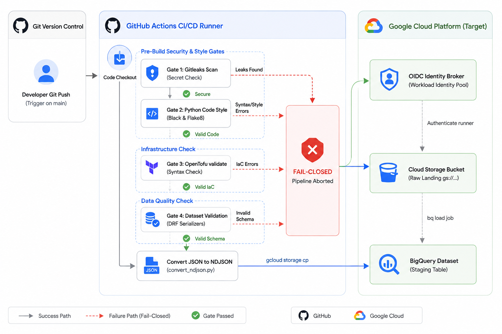
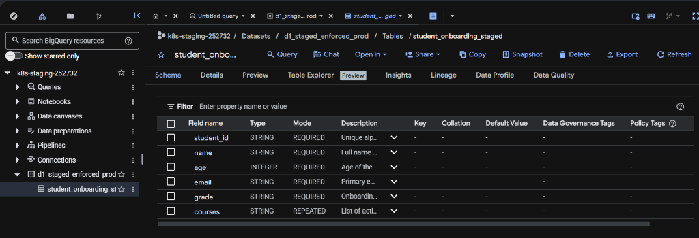

# Zero-Trust Data Ingestion & Schema Validation Pipeline

**Author:** Prakriti Mandal  
**Contact:** prakritimandal611@gmail.com  
**Repository:** [schema-contract-validator](https://github.com/prakrit55/schema-contract-validator)

---

## 📌 Project Overview
This repository contains the code and configuration for a secure, keyless, and automated data ingestion and quality gate pipeline on Google Cloud Platform (GCP). 

The system enforces a **"Fail-Closed"** model: any security vulnerabilities (leaked secrets), syntax/lint errors, infrastructure violations, or data schema mismatches in datasets will immediately abort the build gate, protecting the downstream Google Cloud Storage landing buckets and Google BigQuery datasets from corruption.

---

## 📁 Repository Structure
```
├── .github/
│   └── workflows/
│       └── workflow.yaml       # GitHub Actions CI/CD workflow definition
├── bigquerydataset/
│   ├── locals.tf               # OpenTofu local variables mapping
│   ├── main.tf                 # OpenTofu GCP infrastructure definitions (GCS, BigQuery, IAM)
│   ├── providers.tf            # OpenTofu provider configuration
│   ├── variables.tf            # Custom variables definition
│   └── outputs.tf              # Target resource outputs
├── datasets/
│   └── student_onboarding_staged.json  # Raw student onboarding dataset (JSON Array format)
├── diagrams/
│   ├── pipeline_architecture.png       # Pipeline architecture diagram image
│   └── bigquery_schema.png             # BigQuery console table schema screenshot
├── validatordcyn/
│   ├── serialiser.py           # Django/DRF schema verification script (DCYN library)
│   └── convert_ndjson.py       # JSON-to-NDJSON formatting script
├── requirements.txt            # Python dependencies list
├── BigQuery_Ingestion_Pipeline.pptx # Project architecture slides presentation
└── README.md                   # Project documentation
```

---

## ⚙️ Logic Flow & Automated Build Gates

The pipeline runs in a linear sequence inside GitHub Actions. If a step fails, the pipeline halts immediately (**Fail-Closed**):


### 1. Security Gate (Gitleaks Scan)
Scans the commit history for accidentally committed private keys, service account JSON files, or database passwords. The scanner terminates the pipeline with exit code 1 if a leak is found.

### 2. Code Quality Gate (Black & Flake8)
Enforces syntax, styling, and coding best practices:
*   `black --check .` verifies formatting rules.
*   `flake8` verifies code health, scanning for syntax faults or uninitialized variables.

### 3. Infrastructure Gate (OpenTofu validate)
Runs `tofu fmt` and `tofu validate` on the `bigquerydataset/` directory to check the syntax correctness of your GCS bucket, BigQuery datasets, and IAM declarations before any deployment.

### 4. Keyless Authentication Gate (OIDC Workload Identity Federation)
The runner exchanges its signed GitHub OIDC token with GCP's Workload Identity Pool (`github-deployer`) to receive a short-lived access token, bypassing the need to store static `GCP_SA_KEY` secrets.

### 5. Data Quality Gate (Django REST Framework Serializer)
The validator script runs incoming payloads against a mock in-memory database and Django REST Framework serializers. If a field violates constraint limits (length, size, email formats), the step exits with code 1 and blocks ingestion.

---

## 🛠️ Data Quality & Conversion Scripts

### 1. Schema Validation: `serialiser.py`
This script deconstructs the onboarding JSON payload and validates fields against strict limits to eliminate human judgment.
*   **Exact Limits:**
    *   `student_id`: Character string between 3 and 10 characters.
    *   `age`: Integer between 5 and 100.
    *   `email`: Valid format (`user@domain.com`).
    *   `grade`: Restricted choices (`A`, `B`, `C`, `D`, `F`).
    *   `courses`: Non-empty list containing non-empty strings.
*   **DCYN Validation Library:**
    The script simplifies the output by generating a binary logic status (`Yes`/`No`) for each column:
    ```json
    "dcyn_library": {
      "student_id": "Yes",
      "name": "Yes",
      "age": "No",
      "email": "No",
      "grade": "No",
      "courses": "No"
    }
    ```

*   **⚠️ Common Pipeline Errors Faced & Troubleshooting:**
    1.  **JSON Syntax Crash (Comments Violation):**
        *   *Error Output:* `Invalid JSON syntax: Expecting value: line 1 column 1 (char 0)`
        *   *Root Cause:* Developers attempting to document JSON records using inline comments (`// ...`). Standard JSON specifications do not support comments.
        *   *Remediation:* Keep dataset files containing raw JSON arrays only.
    2.  **Schema Compliance Crash (Validation Violation):**
        *   *Error Output:*
            ```json
            "errors": {
              "student_id": ["Ensure this field has no more than 10 characters."],
              "age": ["Ensure this value is greater than or equal to 5."]
            }
            ```
        *   *Root Cause:* Input records violating serializer constraints (e.g. Student ID exceeding 10 characters, age under 5, invalid email domain).
        *   *Remediation:* The pipeline triggered the **Fail-Closed** status, blocking GCS uploads until data was corrected.

### 2. NDJSON Formatting: `convert_ndjson.py`
BigQuery expects newline-delimited JSON objects (NDJSON) rather than standard JSON arrays. 
*   **Purpose:** Strips array brackets `[ ]` and separating commas `,` between JSON records.
*   **Encoding Safeness:** Ensures the file is encoded in **UTF-8 without a BOM**, bypassing standard PowerShell redirector (`>`) bugs that generate invalid UTF-16 characters.

---

## 📊 Google BigQuery Schema Contract
The data ingestion pipeline maps directly to the Google BigQuery table schema in the staging environment. 

Below is the verified schema for the `student_onboarding_staged` table in project `k8s-staging-252732` (dataset `d1_staged_enforced_prod`), which aligns exactly with our Django REST Framework model serializer contract:




---

## 🔐 Keyless Authentication Setup (Workload Identity Federation)
To run the GitHub Actions workflow without static private keys, configure GCP Workload Identity Federation:

### 1. Create the Service Account
```powershell
gcloud iam service-accounts create github-actions-deployer --display-name="GitHub Actions Deployer" --project=k8s-staging-252732
```

### 2. Create the Workload Identity Pool
```powershell
gcloud iam workload-identity-pools create "github-deployer" --project="k8s-staging-252732" --location="global" --display-name="GitHub Actions Pool"
```

### 3. Create the OIDC Workload Identity Provider
```powershell
gcloud iam workload-identity-pools providers create-oidc "github-prakrit55-v2" --project="k8s-staging-252732" --location="global" --workload-identity-pool="github-deployer" --display-name="github-prakrit55-v2" --attribute-mapping="google.subject=assertion.sub,attribute.repository=assertion.repository" --attribute-condition="assertion.repository == 'prakrit55/schema-contract-validator'" --issuer-uri="https://token.actions.githubusercontent.com"
```

### 4. Authorize Repository Impersonation (Workload Identity User)
Allow the GitHub repository `prakrit55/schema-contract-validator` to impersonate the service account:
```powershell
gcloud iam service-accounts add-iam-policy-binding "github-actions-deployer@k8s-staging-252732.iam.gserviceaccount.com" --project="k8s-staging-252732" --role="roles/iam.workloadIdentityUser" --member="principalSet://iam.googleapis.com/projects/898698082979/locations/global/workloadIdentityPools/github-deployer/attribute.repository/prakrit55/schema-contract-validator"
```

### 5. Grant Minimum Required Roles to Service Account
Grant permissions to allow the pipeline runner to upload files to GCS and execute BigQuery loading jobs:
```powershell
# Grant GCS Object Admin
gcloud projects add-iam-policy-binding k8s-staging-252732 --member="serviceAccount:github-actions-deployer@k8s-staging-252732.iam.gserviceaccount.com" --role="roles/storage.objectAdmin"

# Grant BigQuery Job User
gcloud projects add-iam-policy-binding k8s-staging-252732 --member="serviceAccount:github-actions-deployer@k8s-staging-252732.iam.gserviceaccount.com" --role="roles/bigquery.jobUser"

# Grant BigQuery Data Editor
gcloud projects add-iam-policy-binding k8s-staging-252732 --member="serviceAccount:github-actions-deployer@k8s-staging-252732.iam.gserviceaccount.com" --role="roles/bigquery.dataEditor"
```

---

## 🌐 Local Development Setup

### Prerequisite Dependencies:
Install requirements using pip:
```powershell
pip install -r requirements.txt
```

### Validate a Dataset Locally:
Run the validation script against a dataset folder:
```powershell
python validatordcyn/serialiser.py datasets
```

### Convert JSON to NDJSON:
```powershell
python validatordcyn/convert_ndjson.py datasets/student_onboarding_staged.json datasets/student_onboarding_staged.ndjson
```
